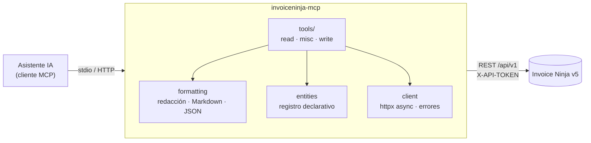

<div align="center">

# 🥷 invoiceninja-mcp

**Conectá tu facturación de [Invoice Ninja](https://invoiceninja.com) a cualquier asistente de IA compatible con MCP.**

Preguntá en lenguaje natural por clientes, facturas, pagos, gastos y reportes,
directamente sobre los datos de tu instancia.

[](LICENSE)
[](https://www.python.org/)
[](https://modelcontextprotocol.io)
[](https://api-docs.invoicing.co/)
[](https://docs.astral.sh/uv/)
[](https://docs.astral.sh/ruff/)
[](https://mypy-lang.org/)

[Características](#-características) ·
[Inicio rápido](#-inicio-rápido) ·
[Herramientas](#-herramientas) ·
[Seguridad](#-seguridad) ·
[Desarrollo](#-desarrollo) ·
[Licencia](#-licencia)

</div>

---

## 💬 ¿Qué podés preguntarle?

> «¿Qué facturas están vencidas y cuánto suman por moneda?»
>
> «Mostrame los pagos que recibimos este trimestre de Acme.»
>
> «Armá un resumen de pérdidas y ganancias del año pasado.»
>
> «¿Qué clientes tienen saldo pendiente mayor a 1.000?»
>
> «¿Cuánto facturamos el mes pasado comparado con lo cobrado?»

El asistente encuentra los registros, sigue la paginación, resuelve IDs a nombres y te responde con los datos reales de tu instancia.

## ✨ Características

- 🔒 **Solo lectura por defecto.** Crear, editar o enviar requiere habilitarlo explícitamente.
- 🧾 **Cobertura amplia de la API v5:** 13 entidades principales, 14 tablas de referencia, búsqueda, dashboard y más de 25 tipos de reporte.
- 🧠 **Respuestas pensadas para LLMs:** tablas Markdown con nombres de cliente, estados legibles («pagada», «vencida»), fechas ISO y pistas de paginación. También hay modo JSON compacto con selección de campos.
- 🕵️ **Redacción de secretos:** se eliminan semillas 2FA, tokens OAuth, tokens de pasarelas y los links «al portador» (login sin contraseña al portal, links de ver/pagar). El token de la API nunca aparece en la salida.
- 📊 **Reportes asíncronos resueltos:** el servidor espera el resultado y, si tarda, devuelve un `report_id` para consultarlo después.
- ⚡ **Errores accionables:** cada fallo explica qué revisar (token, permisos, ID inexistente, límite de peticiones…).
- 🔌 **stdio o HTTP** (streamable-http).
- ☁️ **Hosted o self-hosted:** funciona con [invoicing.co](https://invoicing.co) y con tu propia instalación.

## 🚀 Inicio rápido

### 1. Requisitos

- Python **3.12+** y [uv](https://docs.astral.sh/uv/getting-started/installation/)
- Un token de API de Invoice Ninja: **Settings → Account Management → API Tokens**

### 2. Instalación

```bash
git clone https://github.com/<tu-usuario>/invoiceninja-mcp.git
cd invoiceninja-mcp
uv sync
```

### 3. Conectalo a tu cliente MCP

<details open>
<summary><b>Claude Code</b></summary>

```bash
claude mcp add invoiceninja \
  -e INVOICENINJA_URL=https://invoicing.co \
  -e INVOICENINJA_API_TOKEN=tu-token \
  -- uv run --project /ruta/a/invoiceninja-mcp invoiceninja-mcp
```

</details>

<details>
<summary><b>Claude Desktop y otros clientes con configuración JSON</b></summary>

Agregalo a la configuración de servidores MCP de tu cliente (en Claude Desktop: `claude_desktop_config.json`):

```json
{
  "mcpServers": {
    "invoiceninja": {
      "command": "uv",
      "args": ["run", "--project", "/ruta/a/invoiceninja-mcp", "invoiceninja-mcp"],
      "env": {
        "INVOICENINJA_URL": "https://invoicing.co",
        "INVOICENINJA_API_TOKEN": "tu-token"
      }
    }
  }
}
```

</details>

<details>
<summary><b>HTTP (streamable-http)</b></summary>

```bash
INVOICENINJA_URL=https://invoicing.co INVOICENINJA_API_TOKEN=tu-token \
  uv run invoiceninja-mcp --transport streamable-http --host 127.0.0.1 --port 8000
```

Endpoint: `http://127.0.0.1:8000/mcp`

> [!WARNING]
> El endpoint HTTP **no tiene autenticación propia**. Mantenelo en `127.0.0.1` o ponelo detrás de un proxy que autentique. Si lo ligás a otra dirección, el servidor lo advierte por stderr.

</details>

### 4. Probalo

Pedile a tu asistente: *«Verificá la conexión con Invoice Ninja»*. Debería responder con el nombre de tu empresa y del usuario del token.

## ⚙️ Configuración

Todo se configura con variables de entorno. Hay una plantilla en [`.env.example`](.env.example), pero el servidor no lee archivos `.env`: las variables las pasa el cliente MCP o el shell.

| Variable | Requerida | Default | Descripción |
|---|:---:|---|---|
| `INVOICENINJA_URL` | ✅ | — | URL raíz de la instancia (`https://invoicing.co` o tu self-hosted). Se tolera un `/api/v1` final. |
| `INVOICENINJA_API_TOKEN` | ✅ | — | Token de API. |
| `INVOICENINJA_ENABLE_WRITES` | | `false` | `true` registra las herramientas de escritura. |
| `INVOICENINJA_TIMEOUT` | | `30` | Timeout HTTP en segundos. |
| `INVOICENINJA_VERIFY_SSL` | | `true` | `false` para certificados autofirmados. |

## 🧰 Herramientas

### Consulta (siempre disponibles)

| Herramienta | Descripción |
|---|---|
| `invoiceninja_ping` | Verifica la conexión y muestra empresa y usuario. |
| `invoiceninja_search` | Busca clientes, contactos, facturas y proyectos por nombre, email o número. |
| `invoiceninja_list_<entidad>` | Lista con filtros, orden y paginación. |
| `invoiceninja_get_<entidad>` | Registro completo (con ítems, contactos, etc.). |
| `invoiceninja_list_records` · `invoiceninja_get_record` | Tablas de referencia y secundarias. |
| `invoiceninja_get_statics` | Monedas, países, tipos de pago, idiomas, zonas horarias… |
| `invoiceninja_dashboard_totals` | Facturado, cobrado, pendiente y gastos por moneda. |
| `invoiceninja_run_report` · `invoiceninja_get_report_result` | Reportes nativos de Invoice Ninja. |

<details>
<summary><b>Entidades cubiertas</b></summary>

**Principales** (herramientas dedicadas `list_*` / `get_*`):
clientes · facturas · presupuestos · créditos · pagos · facturas recurrentes · productos · gastos · gastos recurrentes · proveedores · proyectos · tareas · órdenes de compra

**Referencia** (vía `list_records` / `get_record`):
tasas de impuesto · condiciones de pago · categorías de gasto · estados de tarea · grupos de clientes · diseños · documentos · transacciones bancarias · actividad · etiquetas · ubicaciones · suscripciones · presupuestos recurrentes · usuarios

</details>

<details>
<summary><b>Reportes disponibles</b></summary>

Facturas e ítems · presupuestos e ítems · recurrentes e ítems · créditos · pagos · gastos · productos · ventas por producto · clientes y contactos · proveedores · órdenes de compra e ítems · tareas · proyectos · documentos · actividad · **pérdidas y ganancias** · **antigüedad de deuda** (detalle y resumen) · saldos de clientes · ventas por cliente · ventas por usuario · **resumen y período de impuestos**

</details>

<details>
<summary><b>Filtros en los listados</b></summary>

| Parámetro | Ejemplo |
|---|---|
| `filter` | texto libre: `"acme"` |
| `client_status` | `"unpaid,overdue"` en facturas, `"approved"` en presupuestos |
| `client_id` | solo los registros de un cliente |
| `status` | `"active"`, `"archived"`, `"deleted"` |
| `sort` | `"date\|desc"` |
| `extra_filters` | `{"date_range": "2026-01-01,2026-03-31"}`, `{"balance": "gt:0"}` |
| `fields` | en JSON, solo los campos pedidos: `["number", "client_name", "balance"]` |

Cada herramienta documenta los valores válidos para su entidad.

</details>

### Escritura (opcionales)

Solo existen con `INVOICENINJA_ENABLE_WRITES=true`:

| Herramienta | Descripción |
|---|---|
| `invoiceninja_create_record` | Crea clientes, facturas, pagos, gastos, productos… |
| `invoiceninja_update_record` | Actualiza solo los campos indicados. |
| `invoiceninja_bulk_action` | Archivar, restaurar, borrar, enviar por email, marcar enviada/pagada, aprobar, convertir… Las acciones se validan por entidad antes de llamar a la API. |

## 🛡️ Seguridad

| Medida | Detalle |
|---|---|
| Mínimo privilegio | Sin escrituras salvo opt-in explícito; las herramientas se anotan como `readOnly` o `destructive` para que el cliente pueda pedir confirmación. |
| Redacción | Secretos y links de acceso se eliminan en listados, registros, reportes, dashboard y respuestas de escritura. |
| Token protegido | Nunca se incluye en respuestas ni en mensajes de error, aunque el servidor remoto lo refleje. |
| IDs validados | Los IDs se restringen a caracteres seguros antes de armar URLs, sin posibilidad de path traversal. |
| Respuestas acotadas | Límite de 25.000 caracteres por respuesta; el JSON se recorta por registros, nunca a mitad de texto. |

> [!TIP]
> Creá un token dedicado para el asistente con un usuario de permisos limitados. Invoice Ninja respeta los permisos del usuario dueño del token.

## 🏗️ Arquitectura



Las herramientas se generan a partir de un **registro declarativo de entidades** (`entities.py`). Agregar una entidad nueva es, en general, agregar una entrada al registro.

## 🧑‍💻 Desarrollo

```bash
uv sync                                    # dependencias + grupo dev
uv run pytest                              # tests offline (HTTP mockeado, protocolo MCP real)
uv run pytest tests/test_read_tools.py::test_get_invoice   # un test puntual
uv run ruff check && uv run ruff format --check
uv run mypy src tests                      # tipado estricto
```

**Smoke tests contra una instancia real** (solo lectura; la demo pública funciona):

```bash
INVOICENINJA_URL=https://demo.invoiceninja.com INVOICENINJA_API_TOKEN=TOKEN uv run pytest -m live
```

**Inspector MCP interactivo:**

```bash
npx @modelcontextprotocol/inspector uv run invoiceninja-mcp
```

<details>
<summary><b>Estructura del proyecto</b></summary>

```
src/invoiceninja_mcp/
├── config.py        # variables de entorno y validación
├── client.py        # cliente HTTP async y mapeo de errores
├── entities.py      # registro declarativo de entidades
├── formatting.py    # redacción, normalización, Markdown/JSON
├── server.py        # armado del servidor y CLI
└── tools/
    ├── read.py      # list/get por entidad + registros de referencia
    ├── misc.py      # ping, búsqueda, statics, dashboard, reportes
    └── write.py     # crear, actualizar, acciones masivas (opt-in)
```

</details>

## 📄 Licencia

Distribuido bajo licencia [MIT](LICENSE). © 2026 Ariel Weher.

## 🙌 Créditos

- [Invoice Ninja](https://github.com/invoiceninja/invoiceninja) y su [documentación de API](https://api-docs.invoicing.co/)
- [Model Context Protocol](https://modelcontextprotocol.io) y su [SDK de Python](https://github.com/modelcontextprotocol/python-sdk)

Proyecto independiente, no afiliado a Invoice Ninja.
